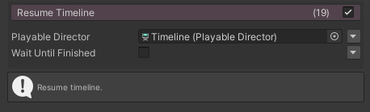

# FungusTimeline

FungusからTimelineを操作するコマンド

## Requirements

- Unity 2020.2.0b2
- [Fungus v3.13.7](https://github.com/snozbot/fungus)

## Git Path (Unity Package Manager)

> https://github.com/kuro3vn-gme/FungusTimeline.git?path=Assets/FungusTimeline

## Commands

### PlayTimeline

選択したPlayableDirectorのTimelineを再生します。

### PauseTimeline

選択したPlayableDirectorのTimelineを一時停止します。

### ResumeTimeline

選択したPlayableDirectorのTimelineを再開します。

### StopTimeline

選択したPlayableDirectorのTimelineを停止します。

